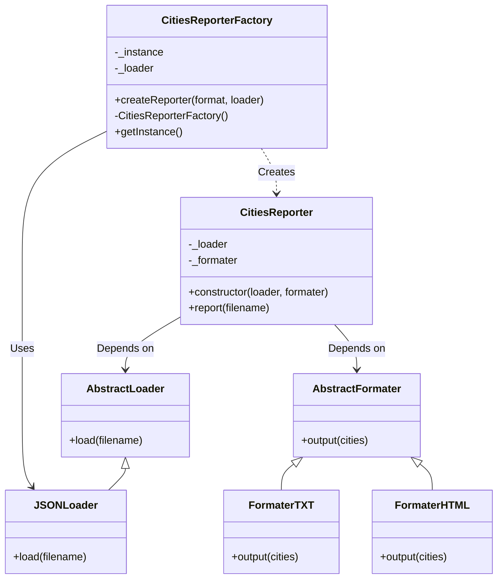

# O Projeto 1 da disciplina ES46A
Arquitetura de Software envolve a implementação
de funcionalidades em um projeto e a sua refatoração utilizando padrões de projeto. As funcionalidades e refatorações devem ser implementadas no projeto disponível em: https://github.com/watinha/es46a-2023-2/tree/strategy/
01-design-patterns-template-strategy. Os alunos devem implementar individualmente ou em dupla o projeto.

# Descrição
O projeto em questão é um sistema de relatório de nomes de cidades, que tem como objetivo ler dados de um arquivo, formatá-los de acordo com o formato desejado e fornecer um relatório desses dados. O projeto demonstra o uso de padrões de projeto, especificamente o padrão Singleton e o padrão Factory Method.

# Explicação
### Padrão Singleton
O padrão Singleton foi implementado na classe CitiesReporterFactory. O Singleton é aplicado quando é necessário garantir que uma única instância de uma classe seja criada e compartilhada em todo o sistema. No projeto, a classe CitiesReporterFactory atua como uma fábrica para criar instâncias da classe CitiesReporter com base no formato de saída desejado. A implementação do Singleton assegura que somente uma única instância da fábrica seja criada e compartilhada em todo o aplicativo. Isso é útil para economizar recursos e garantir que a fábrica não seja instanciada desnecessariamente várias vezes.

A classe CitiesReporterFactory possui um método estático getInstance() que cria uma única instância da fábrica quando necessário. Se a instância já existir, ela retorna a instância existente. Isso garante que a mesma instância da fábrica seja usada em várias partes do sistema, mantendo a coesão e economizando recursos.

### Factory Method
O padrão de projeto Factory Method foi implementado para criar instâncias da classe CitiesReporter. A classe CitiesReporterFactory é responsável por criar essas instâncias com base no formato de saída desejado (por exemplo, texto ou HTML). Essa abordagem torna o sistema flexível, permitindo que novos formatos de relatório sejam adicionados facilmente sem modificar o código existente. Além disso, o Factory Method é flexível o suficiente para permitir a adição de novos tipos de carregadores de dados (por exemplo, suporte a XLSX e CSV), o que também segue o princípio Open/Closed do SOLID.

Embora o código atual utilize apenas o formato JSON para carregar dados, a estrutura permite facilmente estender a capacidade de carregar arquivos de diferentes formatos, como .xlsx, .csv e .json, usando o padrão Factory Method. Isso pode ser feito adicionando novas classes de carregadores (por exemplo, XLSXLoader e CSVLoader) que implementem a interface AbstractLoader. A classe CitiesReporterFactory poderia ser estendida para escolher o carregador apropriado com base no formato do arquivo de entrada.

# Uso
```bash
npm run startHTML
```
ou 
```bash
npm run startTXT
```

# Requisitos
12. Garantir a consistencia do objeto CidadesReport - Padrão de projeto: Singleton
13. Definir os carregadores e reporters - Padrao de projeto: Factory Method

# Diagrama de Classes
 


# Estudantes
- Welyson 🤡
- Gabriel *Não fez poha nenhuma pq estava no latinoware, vulgo fazendo compras no Paraguay, acompanhada pelo direitíssimo diretório acadêmico, cuja integridade é tão transparente quanto o ar de São Paulo e acobertado por professores, com seus salários de magnatas/principescos, não poderiam se importar menos, afinal, quem tem tempo para preocupações mundanas quando se ganha 22 mil reais por mês? Além disso, financiado pela agencia de turismo governo do brasil💸